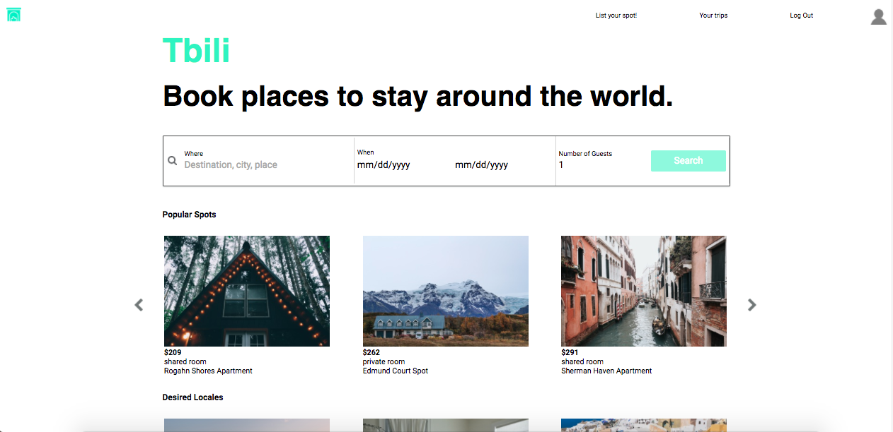
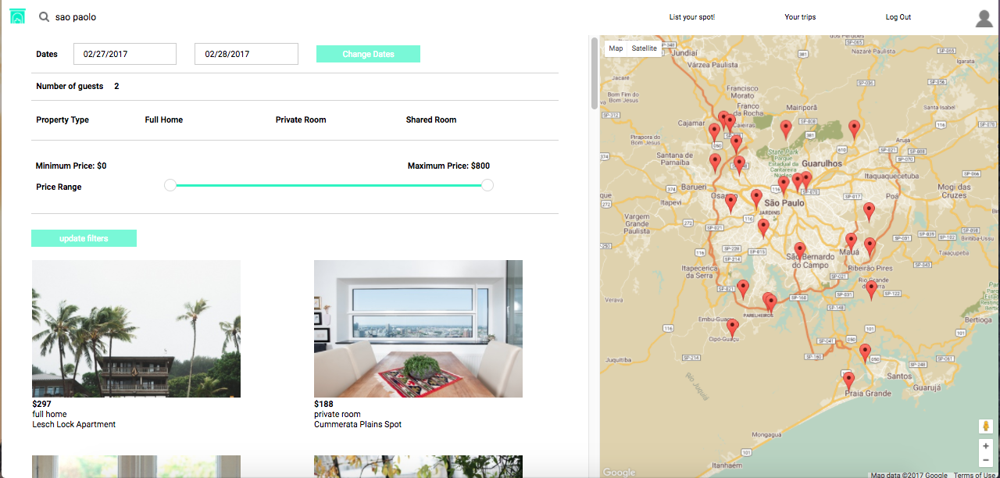

# Tbili

Check out a live version of Tbili here:
[Tbili Live][tbili]

[tbili]: http://www.tbili.co/#/

 Tbili is a fullstack web application modeled after Airbnb’s website.
 It uses Ruby on Rails on the back end in conjunction with React/Redux
 on the front end to deliver an interactive,
 single page web application.

## Features & Implementation

### Back End Composition

Tbili features a simple yet efficient schema design on the back end.
All customers of Tbili are placed in the “Users” table, as every user can be a host,
guest, or both.  Users can become hosts by listing their “Spot”, which holds
information about the size and amenities of a listing.  Bookings is the critical
link between every guest, host, and listed spot.  Each booking has the ability to
hold a review of the guest and the spot, allowing for easy fetching of spot-related
information while adhering to normalized database principles.



### Guarantees of Redux

Attention was given to adhere to the parameters of redux - accordingly every
action that mutates the state of Tbili is enacted through the “Redux” cycle.
In so doing, an arbitrary number of sources of information - whether from
users, the server, or third party APIs, can be added to the application
without concern for producing an unpredictable final application state.


### Featured Destination Carousel

A hand rolled destination carousel was created in order to emulate Airbnb’s
front page.  The carousel uses one “container component” that filters all
spots designated as “featured” in the database into categories (for example,
filtering based on price).  All spots are then passed through a “middle layer”,
the purpose of which is to allocate spots to their proper presentational
component.  This allows for arbitrarily large numbers of presentational
carousel components to be displayed with only one “fetch” hitting the server and
grabbing the spots.


### Search, using Google Geocoder and Google Maps




One of the most important features of Tbili is a search function that incorporates
Google maps.  This functionality is achieved using “addresses” - streets, cities,
states, etc. that can be searched by users.  The address information is
collected in a form component, and before being submitted, sent to the Google
Geocoder API.  From the Google API, the boundaries of the address are extracted,
and these become the boundaries of the google map on the search results page.
In addition, every time the Google map is moved, the boundaries are dynamically updated
and different “spots” are fetched.  This allows for a highly interactive user experience,
where users have total control for how they want
to find their future rental spots using an intuitive interface.

The search form must first hit the Google Geocoder API with the searched
address, then when the AJAX response arrives, the boundaries must be parsed
for the Google Maps API:

```javascript
submitForm(e) {
  e.preventDefault();
  if (this.state.address === "") {
    this.props.fetchSearchSpots({
      start_date: this.state.start_date,
      end_date: this.state.end_date,
      guest_no: this.state.guest_no,
      }
    ).then(() => this.props.router.push("/search"));
  } else {
    fetchBoundaries(this.state.address)
    .then(rawBounds => {
        return parseBoundaries(rawBounds);})
    .then(parsedBounds => this.props.fetchSearchSpots(
      {bounds: parsedBounds,
        start_date: this.state.start_date,
        end_date: this.state.end_date,
        guest_no: this.state.guest_no}
      )
    ).then(() => this.props.router.push("/search"));
  }
}
```

### Spot Creation

Spot creation is achieved through a multi-page form, allowing users to
submit information on pricing, amenities, spot image and location in a
single process.  The first page is a simple form, with errors largely
handled using HTML input error messages.  The second page incorporates
the Paperclip gem, allowing users to upload an image which is stored using
AWS’ ‘Simple Storage Service.’  The last step allows users to input their
address and updates a google map to show them exactly how their spot will
look on the map when presented to users.

The Form is held within one 'mother' component, which passes down a callback
to each child component.  The callback allows the children to change
the state of the mother:

```javascript
handleStepOne(form) {
  this.setState({ newSpot: merge(this.state.newSpot, form), currentForm: 1 });
}

handleStepTwo(form) {
  this.setState({ newSpot: merge(this.state.newSpot, { imageFile: form }), currentForm: 2 });
}
...
```

### Booking Creation

Availability in the Tbili database is stored in ‘blocks,’ allowing hosts
 to have control over when they will have guests.  For example, a host may
 make a ‘block’ for the summer months, and then another ‘block’ for
 December, meaning this is the only time she will host guests in her spot.
 When a booking is created, it holds a foreign key that points to the
 availability block in which it was created.  While this does add some
 extra complexity, what it allows for is to quickly group bookings by their
 containing availability block.  With bookings grouped, it becomes easy
 to find the days for a spot which exist in the availability block but
 do not have a booking.

This solution solves a number of other problems, such as keeping each
available day as a row in a database (given database size constraints)
and dealing with date ranges without one table holding the other's
primary key:

```Ruby
def get_availability
  unbooked_days = []
  availability_blocks = self.availabilities.includes(:bookings)
  availability_blocks.each do |availability_block|
    booked_days = []
    availability_block.bookings.each do |booking|
      booked_days += (booking.start_date..booking.end_date).to_a
    end
    (availability_block.start_date..availability_block.end_date).each do |day|
      unbooked_days.push(day) unless booked_days.include?(day)
    end
  end
  unbooked_days
end
```


## Future Features

Some features that are planned for inclusion include:

 * Incorporation of 'Immutable.js' for closer adherence to Redux principles
 * Multiple login sessions per user, so users can login from multiple devices
 * Data collection for user search, for a more bespoke home screen according to user taste
